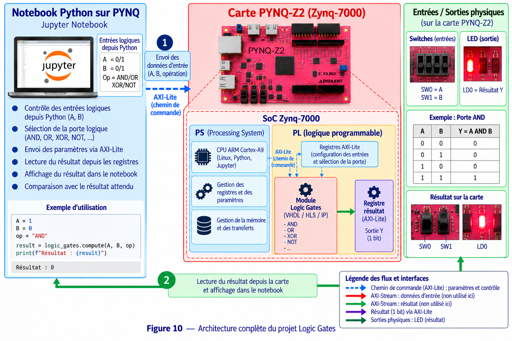

# 1 - Logic Gate Tutorial

## Objectif

Ce premier projet permet de prendre en main la carte **PYNQ-Z2** et de comprendre la communication entre le processeur ARM du Zynq et la logique programmable du FPGA.

Le but est d'implémenter plusieurs portes logiques simples dans la partie programmable puis de les piloter depuis un notebook Python.

## Matériel et logiciels

- Carte PYNQ-Z2 / Zynq-7000
- Vivado 2023.2
- PYNQ
- Jupyter Notebook
- Python
- GPIO du Processing System

## Travail à réaliser

Les fonctions logiques utilisées sont :

- AND
- NOT
- OR
- XOR
- porte AND sur plusieurs bits

Les entrées et sorties des portes sont reliées aux **PS GPIO** du Zynq.

Le notebook charge l'overlay :

```python
from pynq import Overlay
ol = Overlay("./Logic_Gate Tutorial.bit")
```

Les GPIO sont ensuite configurés en entrée ou en sortie. Python permet d'écrire les différentes combinaisons d'entrée puis de lire directement le résultat calculé par la logique FPGA.

## Déroulement

1. Créer les portes logiques dans Vivado.
2. Relier les entrées et sorties aux GPIO du Processing System.
3. Générer le bitstream.
4. Copier les fichiers de l'overlay sur la PYNQ-Z2.
5. Charger le fichier `.bit` depuis Jupyter.
6. Configurer les GPIO avec la bibliothèque PYNQ.
7. Tester les différentes combinaisons d'entrée.
8. Vérifier les tables de vérité obtenues.

## Architecture



Le processeur ARM exécute le notebook Python. Les valeurs d'entrée sont envoyées par les GPIO vers la logique programmable, qui réalise les opérations logiques. Les résultats sont ensuite relus depuis Python.

## Résultat attendu

Les résultats lus depuis le notebook doivent correspondre aux tables de vérité des portes AND, NOT, OR et XOR. Ce projet sert de première étape avant l'utilisation d'architectures plus complexes basées sur HLS, AXI et DMA.
