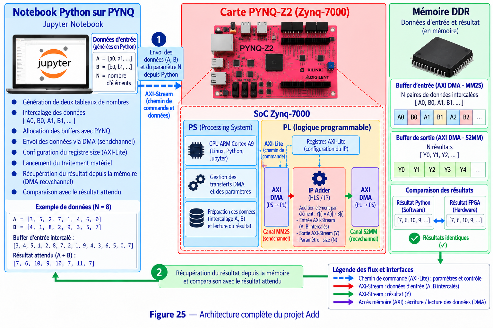

# 11 - Add Tutorial

## Objectif

Ce projet met en œuvre une **addition matérielle sur FPGA** avec la carte **PYNQ-Z2**.

L’objectif est de générer deux tableaux de données dans Python, de les transmettre à une IP HLS à l’aide d’un **AXI DMA**, puis de récupérer les résultats et de les comparer avec le calcul Software.

## Matériel et logiciels

- Carte PYNQ-Z2 / Zynq-7000
- Python / Jupyter Notebook
- C / C++
- Vitis HLS 2023.2
- Vivado 2023.2
- PYNQ
- AXI4-Lite
- AXI4-Stream
- AXI DMA
- Mémoire DDR

## Travail à réaliser

Le projet doit permettre de :

- générer deux tableaux `A` et `B` ;
- calculer une référence Software ;
- préparer les données pour le transfert DMA ;
- entrelacer les entrées sous la forme `A0, B0, A1, B1, ...` ;
- transmettre le nombre d’éléments avec le paramètre `size` ;
- envoyer les données vers l’IP avec le canal **MM2S** ;
- effectuer le calcul `Y[i] = A[i] + B[i]` dans le FPGA ;
- récupérer les résultats avec le canal **S2MM** ;
- comparer les résultats Hardware et Software.

## Fonctionnement Software

La version Software réalise directement le calcul dans Python :

```text
Y[i] = A[i] + B[i]
```

Elle sert de référence pour vérifier les résultats obtenus avec l’accélérateur matériel.

## Fonctionnement Hardware

L’IP principale utilisée est :

```text
adder_dma_0
```

Les deux tableaux sont regroupés dans un seul buffer d’entrée :

```text
A0, B0, A1, B1, A2, B2, ...
```

Pour `N` opérations, le buffer d’entrée contient donc `2 × N` valeurs et le buffer de sortie contient `N` résultats.

Le registre `size` indique à l’IP le nombre d’opérations à effectuer.

## Transfert DMA

Le transfert utilise les deux canaux de l’AXI DMA :

```text
DDR
 ↓
MM2S / sendchannel
 ↓
adder_dma_0
 ↓
S2MM / recvchannel
 ↓
DDR
```

- **MM2S** : envoi du buffer d’entrée vers l’IP ;
- **S2MM** : récupération des résultats produits par l’IP.

## Déroulement

1. Charger l’overlay sur la PYNQ-Z2.
2. Récupérer l’IP `adder_dma_0` et l’AXI DMA.
3. Générer les tableaux `A` et `B`.
4. Calculer les résultats attendus dans Python.
5. Allouer les buffers PYNQ.
6. Entrelacer les valeurs `A` et `B` dans le buffer d’entrée.
7. Configurer le paramètre `size`.
8. Préparer les transferts DMA.
9. Démarrer le traitement matériel.
10. Envoyer les données avec `sendchannel`.
11. Récupérer les résultats avec `recvchannel`.
12. Comparer les valeurs Hardware aux valeurs Software.

Le notebook effectue également un test sur **1024 opérations** afin de vérifier le fonctionnement du calcul matériel sur un ensemble de données plus important.

## Architecture



Le **Processing System** exécute Python et prépare les données en mémoire DDR. Le paramètre `size` et le contrôle de l’IP passent par **AXI4-Lite**.

Les données entrelacées sont envoyées à la logique programmable par le canal **MM2S** de l’AXI DMA. L’IP `adder_dma_0` réalise ensuite les additions et transmet les résultats par AXI4-Stream vers le canal **S2MM**, qui les écrit en mémoire DDR.

## Résultat attendu

Les résultats produits par le FPGA doivent être identiques aux résultats calculés dans Python.

```text
Python → Buffer DDR → DMA MM2S → adder_dma_0
       → DMA S2MM → Buffer DDR → Comparaison Software / Hardware
```
