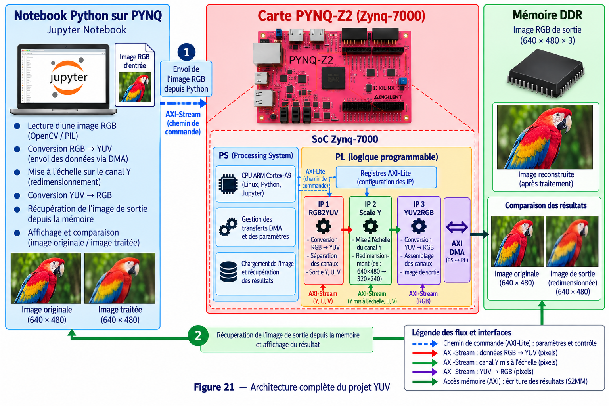

# 3 - YUV Tutorial

## Objectif

Ce projet met en place une première chaîne complète de **traitement d'image accéléré sur FPGA**.

L'objectif est de recevoir une image RGB, de la convertir en YUV, de modifier sa composante de luminance **Y**, puis de reconstruire une image RGB.

## Matériel et logiciels

- Carte PYNQ-Z2 / Zynq-7000
- Python / Jupyter Notebook
- Vitis HLS 2023.2
- Vivado 2023.2
- PYNQ
- AXI4-Lite
- AXI4-Stream
- AXI DMA

## Travail à réaliser

La chaîne matérielle est composée de trois blocs :

```text
RGB → rgb2yuv_ip → scale_y_ip → yuv2rgb_ip → RGB
```

Le bloc `rgb2yuv_ip_0` convertit les pixels RGB en YUV. Le bloc `scale_y_ip_0` modifie la composante Y à partir du paramètre `scale_Y`. Le bloc `yuv2rgb_ip_0` reconvertit ensuite le résultat vers RGB.

## Déroulement

1. Préparer les fonctions de traitement dans Vitis HLS.
2. Synthétiser et exporter les trois IP.
3. Intégrer les IP dans Vivado.
4. Relier les blocs de traitement par AXI-Stream.
5. Ajouter un AXI DMA entre la mémoire et la chaîne matérielle.
6. Générer le bitstream et le fichier `.hwh`.
7. Charger `yuv_filter.bit` depuis PYNQ.
8. Charger l'image d'entrée dans un buffer.
9. Régler `scale_Y` par AXI-Lite.
10. Lancer les trois IP.
11. Envoyer l'image avec `dma_send`.
12. Récupérer le résultat avec `dma_recv`.
13. Afficher l'image obtenue.

## Architecture



Le processeur ARM prépare l'image et configure les IP. Les pixels sont transférés vers la logique programmable par DMA, traversent successivement les trois IP HLS puis reviennent en mémoire.

## Résultat attendu

Le notebook doit afficher l'image traitée par le FPGA. La modification de `scale_Y` doit produire une modification visible de la luminance tout en conservant la chaîne complète RGB → YUV → RGB.
