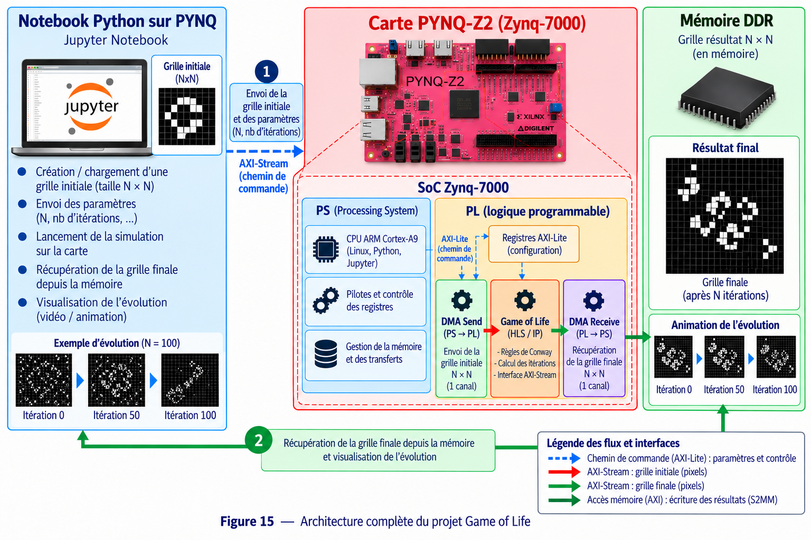

# 4 - Game of Life Tutorial

## Objectif

Ce projet implémente le **Jeu de la vie de Conway** sur FPGA.

Le but est de partir d'une grille de cellules, de calculer matériellement la génération suivante puis de récupérer et afficher le résultat depuis Python.

## Matériel et logiciels

- Carte PYNQ-Z2 / Zynq-7000
- Python / Jupyter Notebook
- Vitis HLS 2023.2
- Vivado 2023.2
- PYNQ
- AXI4-Lite
- AXI4-Stream
- AXI DMA

## Travail à réaliser

Le bloc matériel principal est :

```text
gameoflife_compute_0
```

Le notebook utilise une grille de **512 × 512 cellules**. Deux buffers sont alloués : un buffer d'entrée et un buffer de sortie.

La largeur et la hauteur de la grille sont transmises à l'IP à travers ses registres AXI-Lite.

## Déroulement

1. Implémenter le calcul d'une génération du Game of Life.
2. Synthétiser la fonction avec Vitis HLS.
3. Exporter `gameoflife_compute` comme IP.
4. Intégrer l'IP dans Vivado avec un AXI DMA.
5. Générer le bitstream.
6. Charger `GOL_Tutorial.bit` sur la PYNQ-Z2.
7. Créer une grille initiale aléatoire dans Python.
8. Allouer les buffers avec `pynq.allocate`.
9. Envoyer la grille avec `dma_send`.
10. Démarrer `gameoflife_compute_0`.
11. Récupérer la nouvelle génération avec `dma_recv`.
12. Réutiliser le résultat pour calculer les générations suivantes.
13. Afficher l'évolution de la grille.

## Architecture



Le DMA assure ici les deux directions : **MM2S** pour envoyer la grille au FPGA et **S2MM** pour récupérer la grille calculée.

## Résultat attendu

Les générations successives du Game of Life doivent être calculées par l'IP matérielle et visualisées depuis le notebook PYNQ.
