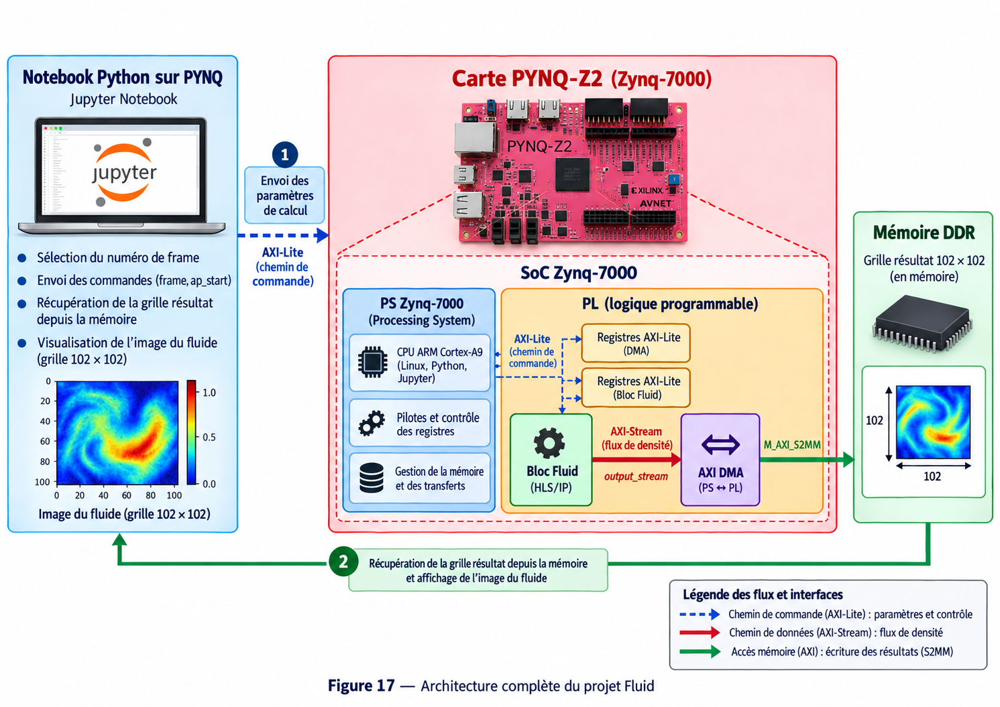

# 🌊 Fluid Simulation — Simulation de fluide sur FPGA





## 1. Présentation du projet

L'objectif de ce projet est de réaliser une simulation de fluide 2D puis de porter les calculs principaux sur FPGA.

Le travail est réalisé progressivement afin de comprendre toute la chaîne de développement d'un accélérateur matériel :

**Python → C/C++ → Vitis HLS → Vivado → FPGA → PYNQ**

Une première version **Software** permet d'observer et de valider le comportement de la simulation. L'algorithme est ensuite adapté en C/C++ afin de créer une IP matérielle avec Vitis HLS.

Cette IP est intégrée dans une architecture Vivado avec un **AXI DMA**. Enfin, un notebook Python exécuté sur la carte PYNQ permet de contrôler l'accélérateur, récupérer les résultats depuis la mémoire et afficher les différentes frames de la simulation.

---

## 2. Cahier des charges

Le projet doit permettre de :

- réaliser une simulation de fluide 2D fonctionnelle en Software ;
- générer plusieurs frames représentant l'évolution du fluide ;
- adapter l'algorithme pour qu'il soit synthétisable avec Vitis HLS ;
- vérifier le fonctionnement du code C/C++ par simulation ;
- générer une IP matérielle à partir de la fonction `fluidsimulation_compute()` ;
- intégrer cette IP dans un Block Design Vivado ;
- utiliser une interface **AXI4-Lite** pour le contrôle de l'IP ;
- utiliser une interface **AXI4-Stream** pour transmettre les résultats ;
- utiliser un **AXI DMA** pour transférer les données vers la mémoire DDR ;
- contrôler l'ensemble depuis Python avec PYNQ ;
- reconstruire et afficher les frames calculées par le FPGA ;
- obtenir un résultat visuellement cohérent avec la version Software.

La simulation travaille sur une grille active de **50 × 50**, à laquelle sont ajoutées les cellules nécessaires à la gestion des limites :

```cpp
#define N 50
#define SIZE (N + 2)
```

La grille manipulée par l'algorithme possède donc une taille totale de **52 × 52**.

---

## 3. Matériel et logiciels utilisés

### Matériel

- Carte **PYNQ-Z2**
- FPGA **Zynq-7000**
- Processeur ARM Cortex-A9
- Mémoire DDR

### Logiciels

- Python
- Jupyter Notebook / PYNQ
- C / C++
- Vitis HLS 2023.2
- Vivado 2023.2

### Interfaces utilisées

- **AXI4-Lite** : commandes et paramètres de l'IP
- **AXI4-Stream** : transmission du flux de données
- **AXI DMA** : transfert des résultats vers la mémoire DDR

---

## 5. Architecture finale


L'architecture finale sépare le système en deux parties :

- **PS (Processing System)** : exécution de Linux, Python/Jupyter, contrôle de l'IP et gestion des transferts ;
- **PL (Programmable Logic)** : exécution matérielle de la simulation Fluid et gestion du flux AXI.

Le chemin de commande passe par **AXI4-Lite**, tandis que les données calculées sont transmises par **AXI4-Stream → AXI DMA → DDR**.

---

## 6. Résultat attendu

À la fin du projet, la simulation doit pouvoir être exécutée directement depuis un notebook Jupyter sur la PYNQ-Z2.

Le notebook pilote l'accélérateur matériel et affiche successivement les frames calculées par le FPGA afin d'obtenir une animation du fluide comparable à celle de la version Software.

Le projet permet ainsi de mettre en pratique toute la chaîne :

**Software → HLS → IP → Vivado → DMA → FPGA → PYNQ**
