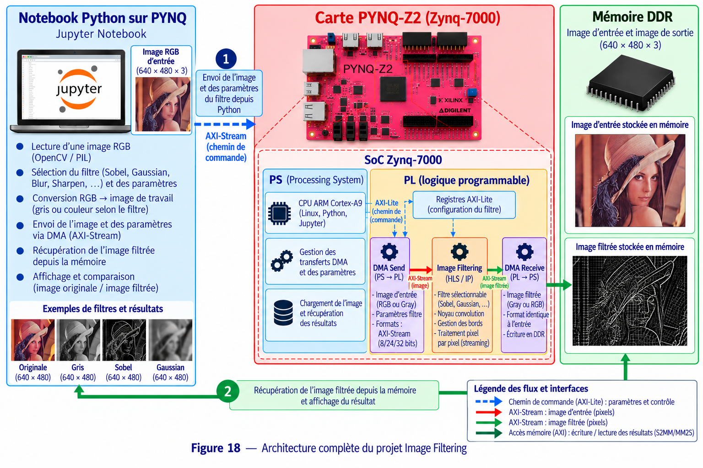

# 6 - Image Filtering Tutorial

## Objectif

Ce projet réalise un **filtrage d'image accéléré matériellement** sur la PYNQ-Z2.

L'objectif est de transmettre une image au FPGA, d'appliquer un filtre dans une IP générée avec Vitis HLS puis de récupérer l'image filtrée dans Python.

## Matériel et logiciels

- Carte PYNQ-Z2 / Zynq-7000
- Python / Jupyter Notebook
- Vitis HLS 2023.2
- Vivado 2023.2
- PYNQ
- NumPy / PIL / Matplotlib
- AXI4-Lite
- AXI4-Stream
- AXI DMA

## Travail à réaliser

Le bloc matériel principal est :

```text
imagefiltering_compu_0
```

Le projet contient une version **Software** et une version **Hardware** afin de pouvoir vérifier le fonctionnement du traitement.

Le notebook Hardware charge `design_1.bit`, configure l'IP, transmet la largeur, la hauteur et les coefficients du filtre puis utilise le DMA pour transférer les pixels.

## Déroulement

1. Charger l'image de test.
2. Préparer la version Software du filtre.
3. Implémenter le traitement en C/C++ pour Vitis HLS.
4. Effectuer la simulation C.
5. Synthétiser et exporter l'IP.
6. Intégrer l'IP dans Vivado avec un AXI DMA.
7. Générer `design_1.bit` et `design_1.hwh`.
8. Charger l'overlay depuis PYNQ.
9. Transmettre `width`, `height` et les coefficients à l'IP.
10. Allouer les buffers d'entrée et de sortie.
11. Envoyer les pixels avec `dma.sendchannel`.
12. Démarrer l'IP.
13. Récupérer les pixels avec `dma.recvchannel`.
14. Reconstruire et afficher l'image filtrée.

## Architecture



Le même AXI DMA est utilisé pour envoyer l'image vers l'IP et récupérer le résultat. Les paramètres du traitement sont configurés depuis le processeur ARM.

## Résultat attendu

L'image filtrée obtenue par la version Hardware doit reproduire le traitement attendu et permettre une comparaison visuelle avec la version Software.
