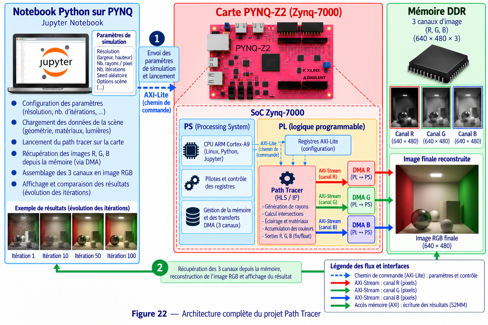

# 7 - Path Tracer Tutorial

## Objectif

Ce projet implémente un **moteur de rendu Path Tracing** dans la logique programmable du Zynq.

Le FPGA calcule les pixels de l'image tandis que Python configure le rendu, récupère les trois composantes RGB et reconstruit l'image finale.

## Matériel et logiciels

- Carte PYNQ-Z2 / Zynq-7000
- Python / Jupyter Notebook
- Vitis HLS 2023.2
- Vivado 2023.2
- PYNQ
- NumPy / PIL / Matplotlib
- AXI4-Lite
- AXI4-Stream
- 3 AXI DMA

## Travail à réaliser

L'IP principale est :

```text
pathtracer_compute_0
```

Dans le notebook Hardware, le rendu est configuré avec :

```text
width   = 200
height  = 200
samples = 10
```

La particularité de cette architecture est l'utilisation de **trois DMA distincts en réception** :

```text
axi_dma_r → canal rouge
axi_dma_g → canal vert
axi_dma_b → canal bleu
```

## Déroulement

1. Préparer et valider l'algorithme de Path Tracing.
2. Adapter le code pour la synthèse HLS.
3. Effectuer la simulation C.
4. Synthétiser `pathtracer_compute`.
5. Exporter l'IP vers Vivado.
6. Construire l'architecture avec trois sorties AXI-Stream.
7. Ajouter un DMA pour chacun des canaux R, G et B.
8. Générer le bitstream.
9. Charger l'overlay dans PYNQ.
10. Régler `width`, `height` et `samples` par AXI-Lite.
11. Préparer les trois buffers de réception.
12. Lancer les trois DMA.
13. Démarrer l'IP.
14. Attendre la fin des transferts.
15. Regrouper R, G et B pour former l'image finale.

## Architecture



Contrairement aux projets utilisant un seul DMA, le Path Tracer sépare directement les trois composantes couleur en trois flux matériels indépendants.

## Résultat attendu

Le FPGA doit générer une image **200 × 200**. Les trois buffers R, G et B sont combinés dans Python puis l'image est sauvegardée sous `pathtracer_hardware.png`.
