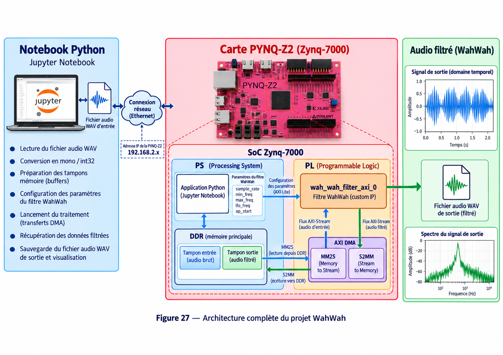

# 8 - Wah-Wah Tutorial

## Objectif

Ce projet réalise un **effet audio Wah-Wah accéléré sur FPGA**.

Un fichier audio WAV est chargé depuis Python, préparé dans un buffer mémoire puis envoyé vers une IP HLS sur la PYNQ-Z2. Le signal filtré est ensuite récupéré par DMA, visualisé et sauvegardé dans un nouveau fichier WAV.

## Matériel et logiciels

- Carte PYNQ-Z2 / Zynq-7000
- Python / Jupyter Notebook
- C / C++
- Vitis HLS 2023.2
- Vivado 2023.2
- PYNQ
- AXI4-Lite
- AXI4-Stream
- AXI DMA
- Mémoire DDR
- Fichiers audio WAV

## Travail à réaliser

Le projet doit permettre de :

- lire un fichier audio WAV depuis Python ;
- convertir et préparer les échantillons pour le traitement matériel ;
- implémenter le filtre Wah-Wah en C/C++ ;
- générer une IP avec Vitis HLS ;
- configurer les paramètres du filtre depuis Python ;
- envoyer le signal audio au FPGA avec le DMA ;
- récupérer le signal filtré ;
- visualiser le résultat dans les domaines temporel et fréquentiel ;
- sauvegarder le signal traité dans un fichier WAV.

L'IP matérielle utilisée dans l'architecture est :

```text
wah_wah_filter_axi_0
```

## Paramètres du filtre

Le notebook transmet à l'IP les paramètres nécessaires au traitement, notamment :

```text
sample_rate
min_freq
max_freq
lfo_freq
```

Le démarrage du calcul est réalisé avec la commande `ap_start`.

## Déroulement

1. Charger le fichier WAV d'entrée.
2. Convertir le signal en mono / `int32` si nécessaire.
3. Préparer les buffers d'entrée et de sortie.
4. Charger l'overlay FPGA.
5. Configurer les paramètres du filtre par AXI4-Lite.
6. Préparer le canal **MM2S** du DMA pour envoyer l'audio.
7. Préparer le canal **S2MM** pour récupérer l'audio filtré.
8. Démarrer l'IP Wah-Wah.
9. Effectuer les transferts DMA.
10. Attendre la fin du traitement.
11. Récupérer le signal de sortie.
12. Visualiser le signal filtré.
13. Calculer et afficher son spectre.
14. Sauvegarder le résultat dans un fichier WAV.

## Architecture



Le signal audio brut est placé dans un buffer de la mémoire DDR. Le DMA utilise son canal **MM2S** pour envoyer les échantillons vers `wah_wah_filter_axi_0`.

L'IP réalise le filtrage puis renvoie les échantillons filtrés par AXI4-Stream. Le canal **S2MM** du DMA écrit ensuite le résultat dans le buffer de sortie en DDR.

Le processeur ARM contrôle les paramètres du filtre et le démarrage de l'IP à travers AXI4-Lite.

## Résultat attendu

Le système doit produire un nouveau fichier WAV contenant le signal traité par l'effet Wah-Wah.

Le notebook permet également de vérifier le résultat avec :

- l'affichage du signal dans le domaine temporel ;
- l'affichage du spectre fréquentiel ;
- l'écoute ou la sauvegarde du fichier audio filtré.

```text
WAV → Buffer DDR → DMA MM2S → Wah-Wah HLS
    → DMA S2MM → Buffer DDR → WAV filtré
```
