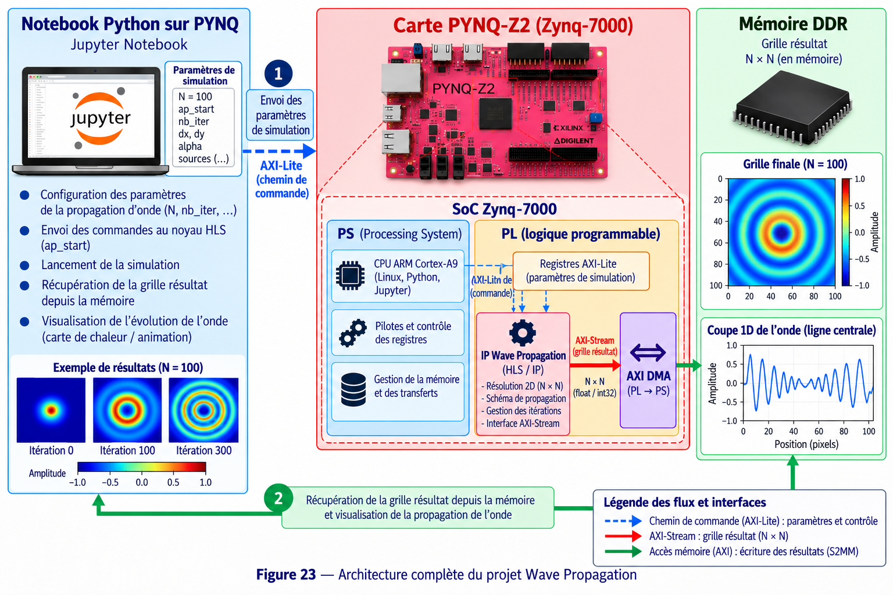

# 9 - WaveProp Tutorial

## Objectif

Ce projet réalise une **simulation de propagation d'ondes 2D accélérée sur FPGA**.

Le calcul principal est exécuté dans une IP HLS. Le notebook PYNQ commande les itérations, récupère chaque grille produite par le FPGA puis affiche l'évolution de l'onde.

## Matériel et logiciels

- Carte PYNQ-Z2 / Zynq-7000
- Python / Jupyter Notebook
- Vitis HLS 2023.2
- Vivado 2023.2
- PYNQ
- NumPy / Matplotlib
- AXI4-Lite
- AXI4-Stream
- AXI DMA

## Travail à réaliser

Le bloc matériel principal est :

```text
waveprop_compute_0
```

La version Hardware utilise une grille de :

```text
100 × 100
```

Le notebook alloue un buffer `int32` de 10 000 valeurs. Contrairement à plusieurs autres projets, le DMA est utilisé ici uniquement côté **réception** :

```python
dma_recv = overlay.axi_dma_0.recvchannel
```

## Déroulement

1. Préparer la simulation Software de référence.
2. Adapter le calcul de propagation en C/C++.
3. Synthétiser la fonction avec Vitis HLS.
4. Exporter `waveprop_compute` comme IP.
5. Intégrer l'IP dans Vivado.
6. Relier sa sortie AXI-Stream à un AXI DMA.
7. Générer le bitstream.
8. Charger `tuto_waveprop.bit` dans PYNQ.
9. Allouer le buffer 100 × 100.
10. Préparer le transfert `recvchannel`.
11. Démarrer `waveprop_compute_0`.
12. Attendre la fin du transfert.
13. Reformater le buffer en matrice 100 × 100.
14. Répéter le calcul sur **200 itérations**.
15. Afficher successivement les différentes grilles.

## Architecture



Le processeur ARM contrôle l'IP par AXI-Lite. Les données produites par le calcul matériel sont envoyées par AXI-Stream vers le DMA puis écrites en mémoire afin d'être récupérées par Python.

## Résultat attendu

Le notebook doit afficher l'évolution de la propagation de l'onde au cours des itérations. Le comportement Hardware doit rester cohérent avec la simulation Software de référence.
