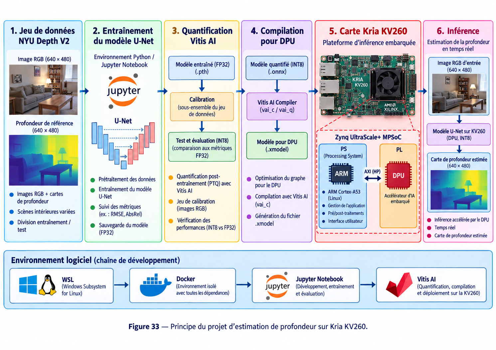

# Kria KV260 — Estimation de profondeur avec Vitis AI

## Objectif

Ce projet met en place une chaîne complète d’**estimation de profondeur à partir d’une image RGB** sur la carte **Kria KV260**.

L’objectif est d’entraîner un modèle **U-Net**, de le quantifier puis de le compiler avec **Vitis AI** afin d’exécuter l’inférence sur le **DPU** de la Kria KV260.

## Matériel et logiciels

- Carte Kria KV260
- Zynq UltraScale+ MPSoC
- Jeu de données NYU Depth V2
- Python / Jupyter Notebook
- WSL (Windows Subsystem for Linux)
- Docker
- Vitis AI
- Modèle U-Net
- DPU (Deep-learning Processing Unit)

## Travail à réaliser

Le projet suit six étapes principales :

1. préparation du jeu de données **NYU Depth V2** ;
2. entraînement du modèle **U-Net** ;
3. quantification du modèle avec **Vitis AI** ;
4. compilation du réseau pour le **DPU** ;
5. déploiement du modèle sur la **Kria KV260** ;
6. exécution de l’inférence et génération d’une carte de profondeur.

## 1. Jeu de données — NYU Depth V2

Le jeu de données contient des scènes intérieures avec :

- une image RGB de **640 × 480** ;
- une carte de profondeur de référence **640 × 480**.

Les données sont séparées en ensembles d’entraînement et de test afin de permettre l’apprentissage puis l’évaluation du modèle.

## 2. Entraînement du modèle U-Net

L’entraînement est réalisé dans un environnement Python / Jupyter Notebook.

Les principales étapes sont :

- prétraitement des données ;
- entraînement du réseau U-Net ;
- suivi des métriques, notamment **RMSE** et **AbsRel** ;
- sauvegarde du modèle entraîné en **FP32** (`.pth`).

## 3. Quantification avec Vitis AI

Le modèle FP32 est ensuite quantifié en **INT8** afin de permettre son exécution efficace sur le DPU.

Cette étape comprend :

- la quantification post-entraînement (PTQ) avec Vitis AI ;
- l’utilisation d’un sous-ensemble du jeu de données pour la calibration ;
- le test du modèle INT8 ;
- la comparaison de ses performances avec le modèle FP32.

Le modèle quantifié est exporté au format `.onnx`.

## 4. Compilation pour le DPU

Le modèle quantifié est compilé avec le **Vitis AI Compiler**.

Cette étape permet :

- d’optimiser le graphe pour le DPU ;
- de compiler le réseau avec Vitis AI ;
- de générer le fichier **`.xmodel`** destiné à l’inférence embarquée.

## 5. Déploiement sur la Kria KV260

La Kria KV260 repose sur un **Zynq UltraScale+ MPSoC**.

Le système est séparé en deux parties :

- **PS (Processing System)** : processeur ARM Cortex-A53 sous Linux, gestion de l’application et des pré/post-traitements ;
- **PL (Programmable Logic)** : DPU utilisé comme accélérateur matériel pour l’inférence IA.

Le PS et le DPU communiquent à travers l’architecture du SoC afin d’exécuter le réseau sur la plateforme embarquée.

## 6. Inférence

Une image RGB **640 × 480** est fournie au modèle U-Net déployé sur la KV260.

Le traitement suit le principe :

```text
Image RGB
   ↓
Prétraitement
   ↓
U-Net INT8
   ↓
DPU — Kria KV260
   ↓
Carte de profondeur estimée
```

Le résultat final est une carte de profondeur **640 × 480** générée à partir de l’image RGB d’entrée.

## Architecture complète



La chaîne de développement complète est :

```text
NYU Depth V2
     ↓
Entraînement U-Net
     ↓
Modèle FP32 (.pth)
     ↓
Quantification Vitis AI
     ↓
Modèle INT8 (.onnx)
     ↓
Compilation Vitis AI
     ↓
Modèle DPU (.xmodel)
     ↓
Kria KV260 / DPU
     ↓
Carte de profondeur estimée
```

L’environnement logiciel utilisé suit également la chaîne :

```text
WSL → Docker → Jupyter Notebook → Vitis AI → Kria KV260
```

## Résultat attendu

Le système doit être capable de recevoir une image RGB, d’exécuter le modèle U-Net quantifié sur le DPU de la Kria KV260 et de produire une **carte de profondeur estimée en temps réel**.

Le résultat peut ensuite être comparé à la carte de profondeur de référence du jeu de données NYU Depth V2.
